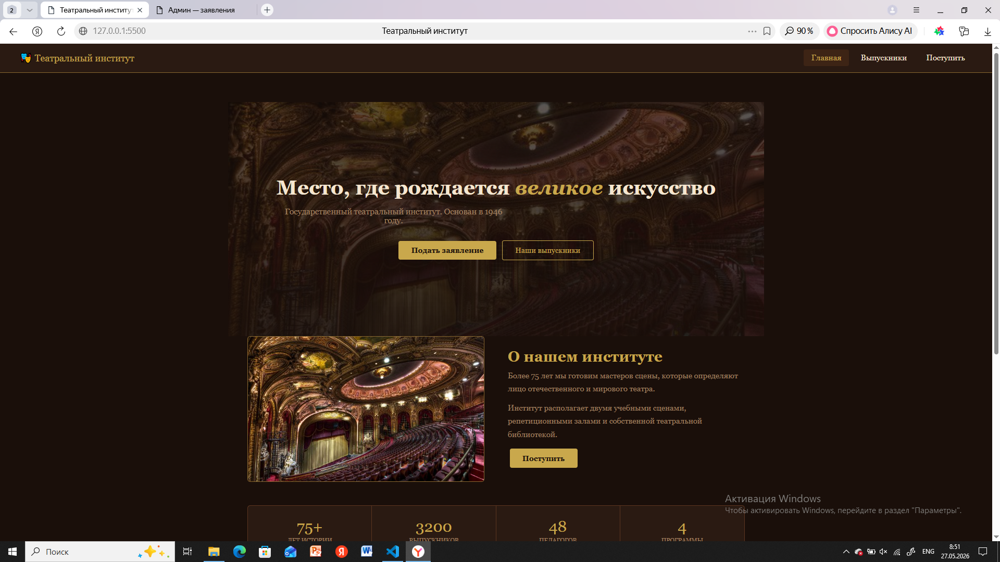
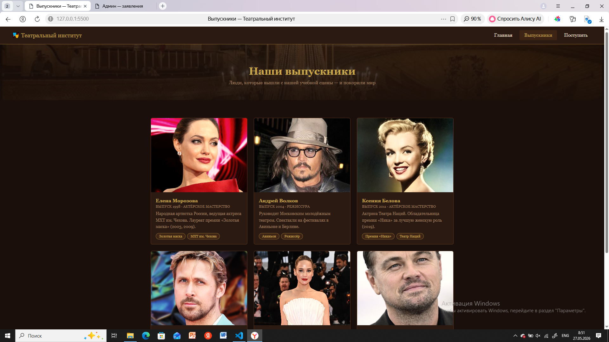
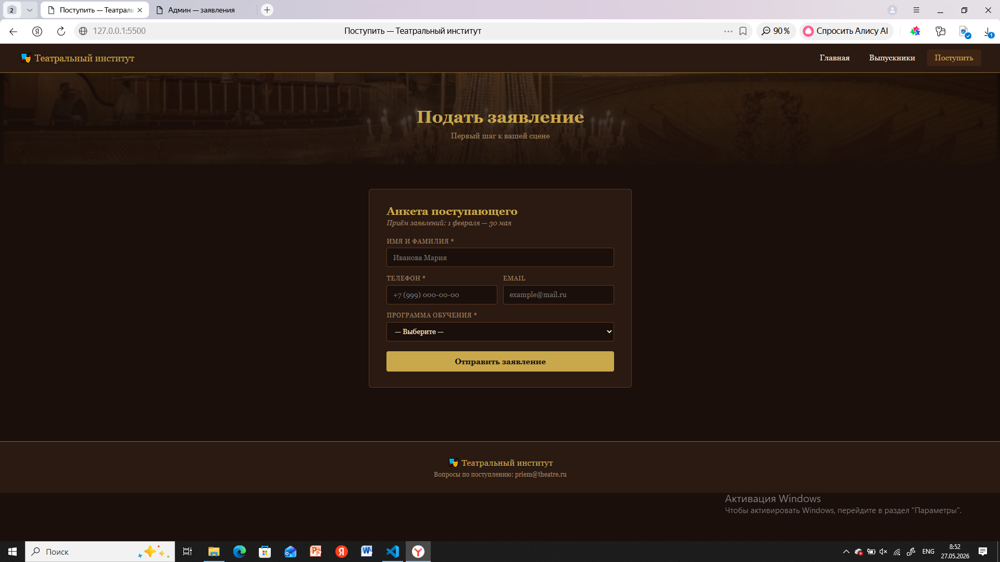
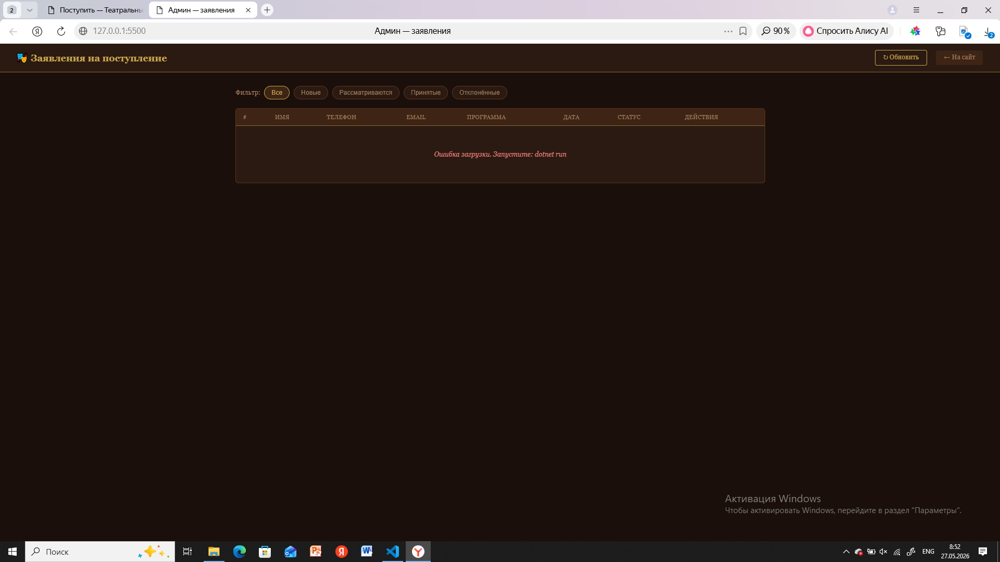

# TheatreInstitute 

Веб-приложение для Государственного театрального института. Проект состоит из фронтенда для пользователей и администратора, а также REST API на платформе .NET для управления заявками.

## Функционал

* **Главная страница:** Информация об институте, ключевые показатели и направления обучения.
* **Страница выпускников:** Список выдающихся студентов с фотографиями.
* **Подача заявления:** Интерактивная форма для абитуриентов.
* **Панель администратора:** Просмотр, фильтрация и управление поступающими заявками в реальном времени.

## Структура проекта

```text
TheatreInstitute/
├── frontend/                  # Клиентская часть приложения
│   ├── img/                   # Папка с изображениями сайта
│   ├── admin.html             # Панель администратора (просмотр заявок)
│   ├── apply.html             # Страница подачи заявления абитуриентом
│   ├── graduates.html         # Страница со списком выпускников
│   ├── index.html             # Главная страница сайта
│   └── style.css              # Общие стили оформления интерфейса
├── TheatreApi/                # Серверная часть приложения (C# / .NET)
│   ├── Controllers/           # Контроллеры обработки API-запросов
│   ├── Data/                  # Контекст базы данных и репозитории
│   ├── Models/                # Модели данных (Заявки)
│   └── Program.cs             # Точка входа и настройка сервисов сервера
├── README.md                  # 
```
## Скрины работы





## Автор
Черкина Дарья ИСП-231